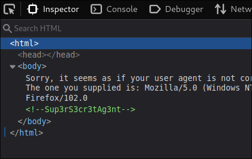

# Don't Bump Your Head(er)

> Try to bypass my security measure on this site! http://165.227.106.113/header.php

__Category:__ Web [MEDIUM]

## Approach

Berikut ini adalah tampilan pertama kali laman `http://165.227.106.113/header.php` ketika dibuka di browser

Terdapat pesan
> Sorry, it seems as if your user agent is not correct, in order to access this website. The one you supplied is: xxxxxxxx

Pesan tersebut bermaksud memberitahu pengunjung jika User-Agent yang digunakan ketika request/mengunjungi laman tersebut bukan User-Agent yang cocok.

Selanjutnya, ketika laman di *inspect element*, terdapat comments yang nampak mencurigakan, yaitu
> `<!-- Sup3rS3cr3tAg3nt  -->`

Kita berasumsi bahwa `Sup3rS3cr3tAg3nt` merupakan User-Agent yang diminta dalam kasus tersebut, selanjutnya kita perlu memodifikasi [Headers](https://developer.mozilla.org/en-US/docs/Web/HTTP/Headers) yaitu User-Agent. 

Untuk dapat melakukan hal ini, kita dapat menggunakan Burpsuite, CURL, atau mengirimkan ulang request pada tab network devtools pada Firefox. (opsi lain dengan membuat program sederhana menggunakan bahasa apapun untuk melakukan HTTP request dengan custom header)
